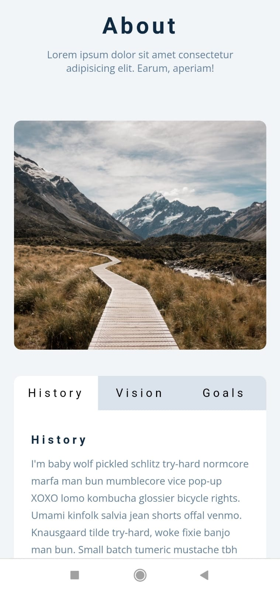
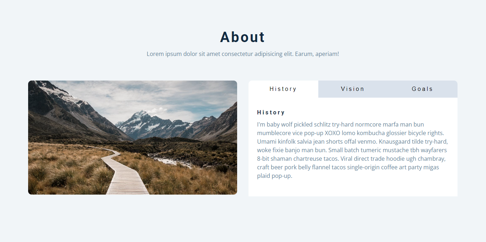

# Tabs

> ⚠️ Este projeto foi baseado no site https://vannilla-js-basic-project-11-tabs.netlify.app/ para fins educativos.

📌O projeto Tabs tem a principal funcionalidade exibir guias com conteúdos diferentes.

Acesse o projeto em produção, [clicando aqui](https://gtm35.github.io/tabs/).

### 📱Versão Mobile:

### 🖥️Versão Desktop:

